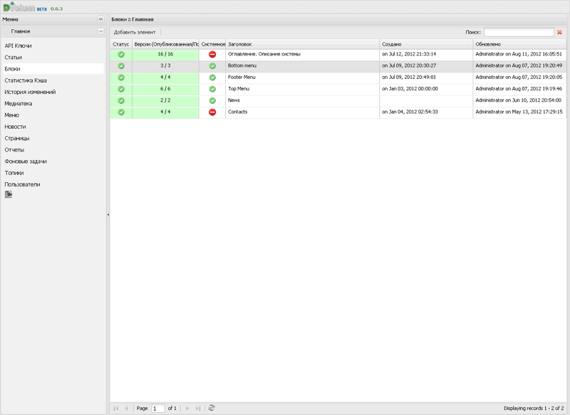
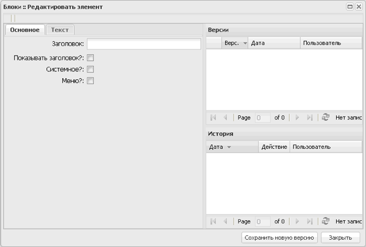
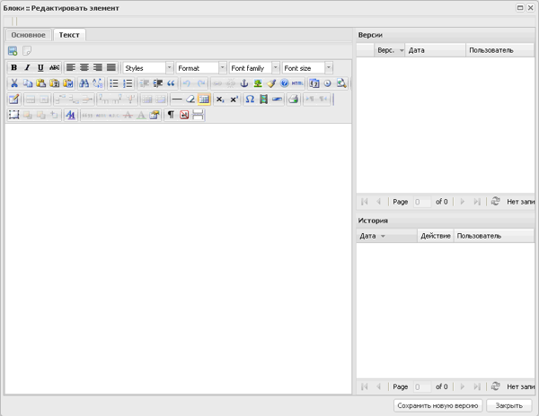
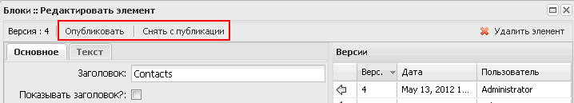
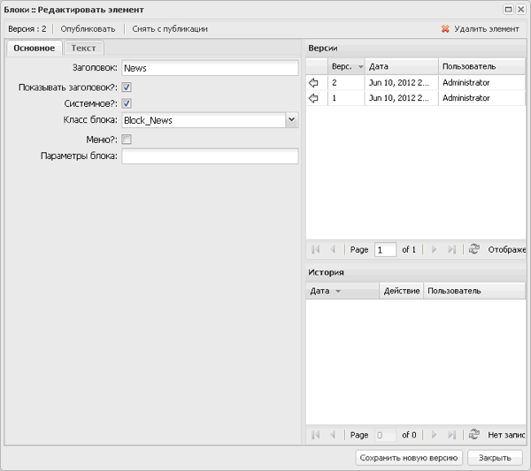

# Описание модуля Блоки

[<< документация](../Readme.md)

Практически каждый сайт в своей публичной части содержит информационные блоки, содержание этих блоков может варьироваться. 
Это может быть навигация, отображение связанной информации, вспомогательные элементы уведомления или реклама.

В платформе DVelum реализован достаточно гибкий функционал управления подобными блоками. 
Создание блоков происходит в интерфейсе управления блоками. Расположение блоков указывается в [интерфейсе управления страницами](pages.md).

Платформа использует три типа блоков:

   * статичные;
   * динамические (описаны классами);
   * блоки меню (связаны с меню).

**Статичные блоки** - обычный элемент страницы с текстом или html, заполнить такое содержание легко в визуальном текстовом редакторе.

**Динамические блоки** - элементы страницы с динамически изменяемым содержимым, за генерацию содержимого для каждого блока отвечает отдельный системный модуль (класс блока). Обычно такие модули реализуются программистами исходя из конкретной задачи. Например, анонс последних новостей.

**Блоки меню** - разновидность динамических модулей, функционал которых уже реализован в платформе. Этот тип блоков может отображать меню из [интерфейса управления меню](menu.md).

## Как работать с блоками

Страница со списком блоков:

На странице управления блоками вы можете видеть таблицу со списком существующих блоков, над таблицей находятся два элемента управления:

   * кнопка «Добавить элемент» - позволяет создать новый блок;
   * поле «Поиск» - помогает найти блок по тексту в заголовке.

Обратите внимание, что блоки можно сортировать, нажимая на заголовки колонок таблицы.

Вызов окна редактирования блока осуществляется двойным кликом по строке блока в таблице.

Таблица блоков включает:

   * столбец «Статус» – содержит значок статуса блока, показывающий, был ли опубликован блок (зеленый значок означает, что блок опубликован);
   * столбец «Версии» – содержит номер версии блока, которая была опубликована последней и номер текущей версии (поле выделяется красным, если номер текущей и опубликованной версии не совпадает);
   * столбец «Системное» – индикатор значения типа блока, зеленый индикатор означает, что блок является динамическим и для него назначен класс;
   * столбец «Заголовок» – содержит заголовок блока;
   * столбец «Создано» – содержит дату и время создания блока;
   * столбец «Обновлено» – содержит наименование учетной записи пользователя, дату и время последнего обновления блока.

## Добавление блока

Для добавления нового блока нажмите на кнопку «Добавить элемент», откроется форма для ввода данных:

Форма содержит:

   * вкладку «Основное» – содержит поля для ввода основных сведений о блоке;
   * вкладку «Текст» – содержит текстовый редактор для заполнения содержимого блока;
   * поле «Версии» – содержит таблицу со списком созданных версий блока, дат и авторов их создания;
   * поле «История» – содержит таблицу со списком действий с блоком, с указанием даты и имени учетной записи пользователя;
   * кнопки «Сохранить новую версию» и «Закрыть».

Основные сведения о блоке включают:

   * поле «Заголовок» – поле для ввода заголовка блока;
   * поле с флажком «Показать заголовок?» – значение поля определяет, показывать ли заголовок блока на странице;
   * поле с флажком «Системное?» – значение поля определяет свойство блока «Системный», при его выборе появляются дополнительные опции выбора системного блока;
   * поле с флажком «Меню?» – значение поля определяет, показывать ли меню в блоке, если флажок установлен, появляется поле выбора меню из выпадающего списка.

Вкладка «Текст» содержит поля:

   * кнопку добавления изображения из медиатеки;
   * кнопку добавления ссылки на элемент медиатеки;
   * текстовый редактор.

Подробное описание работы кнопок приведено в [Описании раздела «Страницы»](pages.md).

После заполнения информации о блоке нажмите на кнопку «Сохранить новую версию» для создания блока. При этом появятся кнопки «Опубликовать» и «Снять с публикации» для публикации созданного блока:

## Редактирование блока

Выберите в списке блоков запись и двойным щелчком левой кнопки мыши откройте форму редактирования:

Откроется форма редактирования блока с заполненными полями. На вкладке «Основное» для системных блоков появляются поля:

   * «Класс блока» – выпадающий список классов, определяющих в коде «поведение» блока (когда мы используем блок с динамическим содержанием, выбираем класс, который реализует логику блока);
   * «Параметры блока» – используются для передачи  настроек классу блока.

После внесения изменений нажмите на кнопку «Сохранить новую версию» для сохранения данных. С помощью кнопки «Опубликовать» опубликуйте последнюю версию блока.