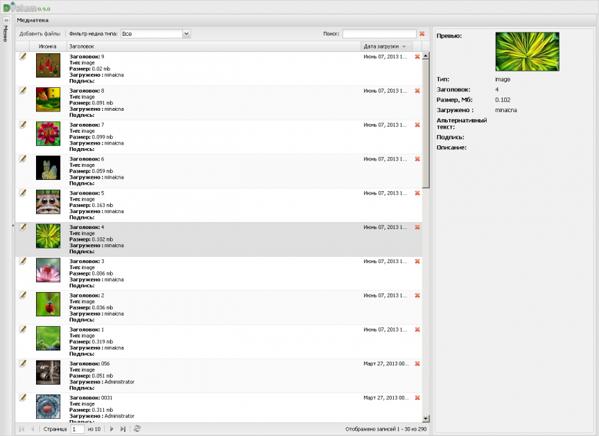
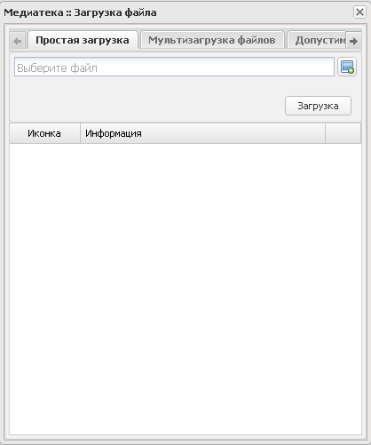
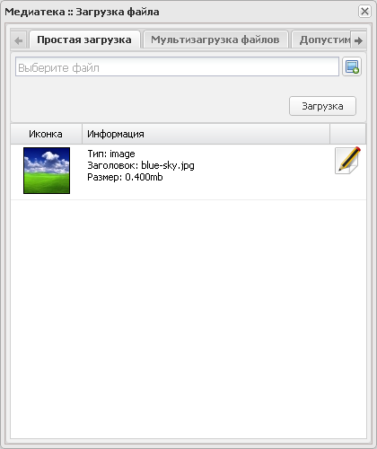
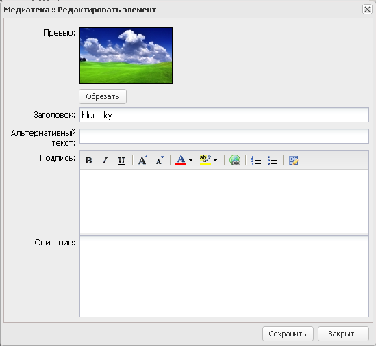
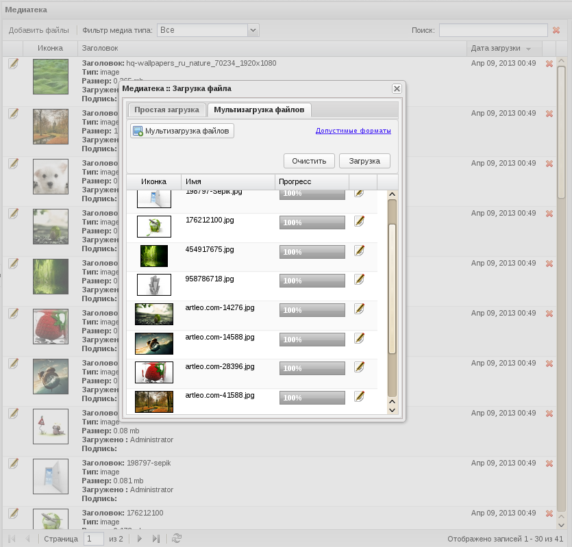
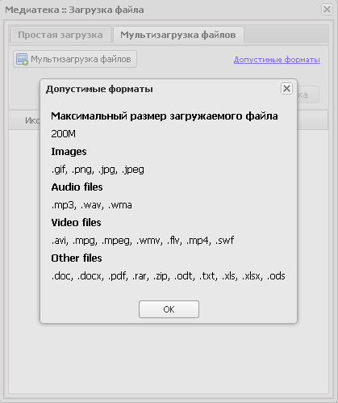
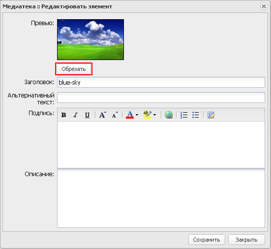
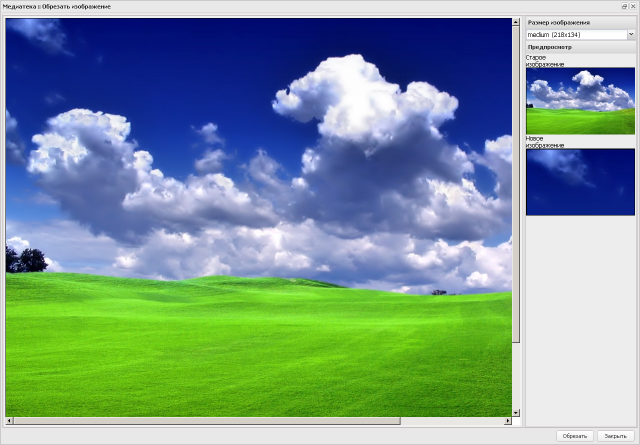
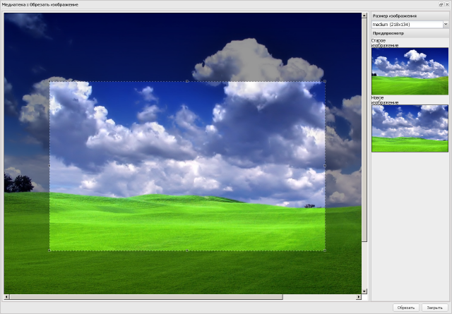

# Описание модуля Медиатека

[<< документация](../Readme.md)

Модуль медиатека - это централизованное хранилище файлов. Администратор загружает файлы в медиатеку, после этого у различных модулей системы появляется доступ к этим файлам. Например, текстовый редактор может вставлять изображения или ссылки на файлы медиатеки.

Необходимо помнить, что медиатека не осуществляет и не контролирует разделение прав доступа к файлам. После загрузки файлы будут доступны по прямым ссылкам. Так же список разрешенных форматов файлов для загрузки ограничен, с ним можно ознакомиться, нажав ссылку «Допустимые форматы» в окне загрузчика файлов.

В медиатеке есть два типа загрузчика файлов:

   * простой - работает на всех платформах и браузерах;
   * расширенный - основан на новых технологиях и позволяет загружать несколько файлов одновременно, отображает миниатюру файла перед загрузкой и процесс загрузки (может не работать на устаревших браузерах).

При загрузке изображений в медиатеку система осуществляет нарезку миниатюр различных размеров для них. Количество и размеры миниатюр определяются программистом/ настройщиком системы в режиме разработки.

При необходимости можно перенарезать миниатюру самостоятельно, как это сделать будет рассказано ниже. Имена файлов миниатюр будут отличаться от оригинального названия файла постфиксом. Например, если вы загрузили на сайт файл picture.jpg , то в том же каталоге будут созданы миниатюры picture-thimbnail.jpg , picture-medium.jpg и т.д.

## Интерфейс медиатеки

Форма содержит:

   * список загруженных файлов медиатеки;
   * кнопку «Добавить файлы» – служит для добавления файлов в медиатеку;
   * поле поиска файла – служит для поиска файла по названию;
   * фильтр «Фильтр медиа типа» – служит для выборки файлов из списка по типу (Все, Файл, Изображение, Аудио, Видео);
   * поле для отображения краткой информации о файле медиатеки (иконка, название, размер в Мб, имя учетной записи пользователя, загрузившего файл, альтернативный текст, подпись, описание).

Загруженные файлы медиатеки располагаются в списке постранично, список содержит атрибуты:

   * кнопка редактирования файла (открыть файл для редактирования можно также двойным кликом мышкой по записи в списке);
   * иконка файла;
   * краткая информация о файле (название, тип, размер в Мб, имя учетной записи пользователя системы, загрузившего файл, описание);
   * дата и время загрузки файла;
   * кнопка удаления файла.

## Добавление файла

Новый файл добавляется в медиатеку нажатием на кнопку «Добавить файлы», при этом открывается форма загрузки файла.

Форма содержит три вкладки:

   * «Простая загрузка» – служит для простой загрузки файлов;
   * «Мультизагрузка файлов» – позволяет добавить несколько файлов одновременно;
   * «Допустимые форматы» – содержит перечень форматов (расширений файлов), доступных для загрузки.

### Вкладка «Простая загрузка»

Вкладка «Простая загрузка» содержит:

   * поле для выбора файла для загрузки;
   * кнопку «Загрузка»;
   * поля для отображения информации о загруженном файле.

Для добавления файла нажмите на кнопку выбора файла, в открывшейся форме выберите файл и нажмите на кнопку «Загрузка». После этого информация о загруженном файле появится внизу формы:

Поля описания содержат иконку добавленного файла, тип, название и размер, напротив добавленного файла расположена кнопка редактирования информации.

По ее нажатию открывается форма просмотра данных файла:

На форме можно заполнить информацию о загруженном файле:

   * «Заголовок» – заголовок файла;
   * «Альтернативный текст»;
   * «Подпись» – подпись для файла;
   * «Описание» – описание файла.

После заполнения формы сохраните данные о файле с помощью кнопки Save.

При загрузке в медиатеку изображения на форме появляется кнопка «Обрезать», которая открывает форму обрезки изображения, подробнее о работе с изображениями см. в разделе «Обрезка изображений».

### Вкладка «Мультизагрузка файлов»

Чтобы добавить в медиатеку несколько файлов одновременно нажмите на кнопку «Выберите файл», в открывшемся окне выберите несколько файлов и нажмите на кнопку «Открыть». Выбранные файлы появятся на форме в виде списка, который можно очистить с помощью кнопки «Очистить». Для загрузки выбранных файлов в медиатеку нажмите на кнопку «Загрузка».

### Вкладка «Допустимые форматы»

Вкладка содержит максимальный размер файла для загрузки в медиатеку и форматы файлов для каждого из типов.

## Обрезка изображений

Для работы с изображением откройте форму просмотра данных файла медиатеки и нажмите на кнопку «Обрезать»:

Откроется форма обрезки изображения:

На форму загружается изображение в оригинальном размере. Справа на форме расположен выпадающий список для выбора размера изображения и иконки для предварительного просмотра обработанной картинки.

Для работы с изображением выберите из выпадающего списка необходимый размер:

    Icon (50x50);
    Mini (72x72);
    Small (82x50);
    Thumbnail (134x81);
    Medium (218x134);
    large (640x480);
    screenshot (800x600).

Список размеров зависит от настроек системы и редактируется в разделе Medialibrary Config, поэтому может отличаться от данного описания.

Далее с помощью левой кнопки мыши выделите на изображении необходимую область:

Область на изображении будет выделяться в пропорции, в зависимости от выбранного размера. После выделения области изображения нажмите на кнопку «Обрезать» для сохранения нового изображения. При этом в иконках «Старое изображение» и «Новое изображение» отобразятся миниатюры изображений.