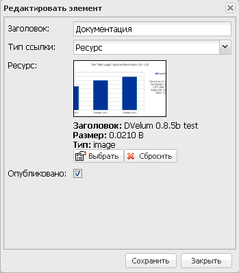

# Описание модуля Меню

[<< документация](../Readme.md)

Список созданных объектов меню размещен в таблице с указанием кода и заголовка объекта:

Страница содержит поле поиска меню по заголовку.

## Добавление меню

Новые меню добавляются с помощью кнопки «Добавить элемент», при этом открывается форма:

На форме заполните поля «Код» (могут использоваться только латинские буквы, цифры и знак "_") и «Заголовок», и нажмите на кнопку «Сохранить».

## Просмотр и редактирование меню

Для просмотра меню откройте форму двойным щелчком левой клавиши мыши по выбранному пункту из списка:

Форма содержит:

   * вкладку «Основное» – содержит поля «Код» и «Заголовок», доступные для редактирования;
   * вкладку «Элементы»;
   * панель «История» – содержит историю изменений данных меню, изменения представлены в таблице с указанием даты, действия и имени учетной записи пользователя, сделавшего изменения (данные расположены постранично);
   * кнопку «Удалить элемент» – служит для удаления меню.

Вкладка «Элементы» имеет вид:

Вкладка содержит:

   * кнопку «Добавить элемент» – позволяет добавить новый пункт меню;
   * кнопку «Добавить подпункт» – добавляет подпункт меню к выбранному пункту в дереве;
   * кнопку «Импортировать из структуры сайта» – загружает дерево, созданных пунктов меню из структуры сайта;
   * кнопку «Удалить» – позволяет удалить пункт меню, выбранный в дереве;
   * дерево элементов меню – содержит список созданных пунктов меню в виде дерева.

## Добавление нового пункта меню

Для добавления нового пункта меню нажмите на кнопку «Добавить элемент» или «Добавить подпункт» (для этого сначала надо выбрать пункт меню в дереве), откроется форма добавления элемента:

Форма содержит:

   * поле «Заголовок» – служит для ввода заголовка пункта меню;
   * выпадающий список «Тип ссылки» – определяет тип пункта меню;
   * поле «URL» – имеет вид, в зависимости от выбранного значения в выпадающем списке «Тип ссылки»;
   * поле с флажком «Опубликовано» – служит для публикации пункта меню.

Выпадающий список «Тип ссылки» содержит значения:

   * «Ресурс» – определяет, что пункт меню будет содержать ссылку на файл из Медиатеки;
   * «Ссылка URL» – определяет, что пункт меню будет содержать ссылку на внешний сайт;
   * «Страница» – определяет, что пункт меню будет содержать ссылку на страницу из дерева сайта.

При выборе для пункта меню типа ссылки «Ресурс» появляется поле для добавления файла из Медиатеки:

Нажмите на кнопку «Выбрать», при этом откроется форма выбора файла Медиатеки:

Выберите объект из списка и нажмите на кнопку «Выбрать», после этого выбранный файл отобразится на форме редактирования пункта меню, с указанием превью файла, заголовка, размера и типа:

Для отмены выбора файла нажмите на кнопку «Сбросить».

При выборе для пункта меню типа ссылки «Ссылка URL» появляется поле для ввода ссылки:

Необходимо ввести адрес ссылки, на который будет вести пункт меню.

При выборе для пункта меню типа ссылки «Страница» появляется выпадающий список для выбора страницы из структуры сайта:

Необходимо выбрать значение из выпадающего списка.

После заполнения полей нажмите на кнопку «Сохранить» для добавления пункта меню.

Не забудьте нажать кнопку «Cохранить» в основном окне редактора меню, чтобы сохранить изменения.
