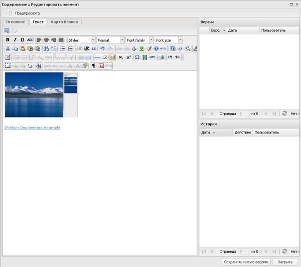

# Описание модуля Страницы

[<< документация](../../Readme.md)

## Просмотр списка страниц

Список страниц отображается в меню «Страницы». Меню содержит:

   * структуру сайта в виде дерева элементов;
   * список страниц;
   * кнопку «Добавить страницу» – служит для добавления новой страницы;
   * кнопку «Добавить подстраницу» – служит для добавления «дочерней» страницы;
   * кнопку «Карта блоков по умолчанию» – показывает карту расположения блоков для темы оформления страницы по умолчанию и позволяет ее редактировать;
   * поле поиска – служит для поиска страницы по тексту в названии страницы и ее коду.
   
   

Структура сайта в виде дерева содержит список созданных страниц с указанием названия и кода страницы. Порядок и вложенность элементов можно корректировать вручную, перетаскивая элементы левой кнопкой мыши в нужное место.

В дереве элементов серые иконки означают неопубликованные страницы, цветные иконки – опубликованные.

Правая часть меню «Страницы» содержит таблицу со списком созданных страниц и их атрибутами:

   * кнопка редактирования страницы (открыть страницу для редактирования можно также двойным кликом мышкой по записи в таблице или в дереве элементов);
   * поле со значком статуса страницы, показывающем была ли страница опубликована (зеленый значок означает, что страница опубликована);
   * поле «Версии (Опубликованная / Последняя)» – содержит номер версии страницы, которая была опубликована последней и номер текущей версии (поле выделяется красным, если номер текущей и опубликованной версии не совпадает);
   * поле «Код страницы» – содержит код страницы;
   * поле «Заголовок» – содержит наименование страницы;
   * поле «Создано» – содержит имя учетной записи пользователя системы, создавшего страницу;
   * поле «Обновлено» – содержит имя учетной записи пользователя системы, обновившего текущую версию страницы.

## Создание страницы

Создать новую страницу можно с помощью кнопок «Добавить страницу» и «Добавить подстраницу». При использовании кнопки «Добавить страницу» страница добавится в корень структуры сайта, после чего  ее можно переместить в нужное место в дереве элементов.

С помощью кнопки «Добавить подстраницу» создается дочерняя страница для выбранного элемента в дереве.

Форма создания страницы имеет вид:

 

Форма содержит:

   * кнопку «Предпросмотр» – позволяет просмотреть внешний вид текущей версии страницы;
   * вкладку «Основное» – служит для заполнения характеристик страницы;
   * вкладку «Текст» – служит для заполнения содержимого страницы;
   * вкладку «Карта блоков» – служит для указания блоков, используемых для этой страницы;
   * поле «Версии» – содержит таблицу со списком созданных версий страницы, дат и авторов их создания;
   * поле «История» – содержит таблицу со списком действий со страницей, с указанием даты и имени пользователя;
   * кнопку «Сохранить новую версию» – служит для сохранения изменений на странице в новой версии.

### Вкладка «Основное»

Вкладка «Основное» содержит поля:

   * Код страницы – поле для ввода уникального кода страницы, состоящего из латинских букв и нижнего подчеркивания;
   * Заголовок меню – поле для ввода заголовка, отображающегося в структуре меню сайта;
   * Заголовок страницы – поле для ввода заголовка, появляющегося на странице;
   * Заголовок Html – поле для ввода заголовка, отображающегося в заголовке браузера;
   * Показывать блоки? – поле с флажком, определяет наличие блоков на странице;
   * Использовать карту блоков по умолчанию - поле с флажком, определяет использовать ли карту блоков по умолчанию или ту, что на вкладке «Карта блоков»;
   * В карте сайта? – поле с флажком, определяет отображать ли страницу в карте сайта;
   * Тема оформления – выпадающий список выбора темы оформления страницы;
   * Meta keywords – поле для ввода ключевых слов для нахождения страницы в поисковых системах;
   * Meta description – поле для ввода описания страницы для нахождения ее в поисковых системах;
   * Прикрепленная функциональность – выбор динамического модуля для прикрепления к странице (например «Новости»).

 
 
После создания страницы (сохранения первой версии) появляются поля:

   * поле «Версия» – содержит текущий номер версии страницы;
   * кнопка «Опубликовать» – позволяет опубликовать выбранную версию страницы;
   * кнопка «Снять с публикации» – отменяет публикацию выбранной версии страницы;
   * кнопка «Удалить элемент» – позволяет удалить созданную страницу.

В поле «Версии» со списком созданных версий страницы можно выбрать версию двойным кликом мыши и открыть ее для редактирования в форме.

После указания основных характеристик страницы переходим к оформлению содержимого.

### Вкладка «Текст»

Вкладка «Текст» содержит поля:

   * кнопку добавления изображения из Медиатеки;
   * кнопку добавления ссылки на элемент Медиатеки;
   * текстовый редактор.

 
 
Для добавления изображения из Медиатеки в текст нажмите на соответствующую кнопку и в открывшемся окне со списком элементов выберите необходимый:

 

Окно содержит список изображений Медиатеки с указанием основной информации о каждом. На форме есть поле поиска для выбора изображения по наименованию. Для выбора изображения выберите нужный элемент в списке и нажмите на кнопку «Выбрать». При этом появится форма выбора размера изображения для вставки в текст страницы:

 

После выбора размера изображения нажмите на кнопку «Выбрать» и изображение появится в тексте:

 

Для добавления ссылки на элемент Медиатеки в текст страницы нажмите на соответствующую кнопку. Окно содержит список элементов Медиатеки с указанием основной информации о каждом. На форме есть поле поиска для выбора элемента по наименованию и выпадающий список типов элементов Медиатеки:

   * Все;
   * Файл;
   * Изображение;
   * Аудио;
   * Видео.

Выберите нужный элемент в списке и нажмите на кнопку «Выбрать». После этого в тексте страницы появится ссылка на выбранный элемент с названием этого элемента:

 

### Вкладка «Карта блоков»

Вкладка «Карта блоков» содержит схему расположения блоков страницы в зависимости от выбранной темы на вкладке «Основное»:

 

Вкладка содержит список элементов разметки страницы и список доступных блоков оформления. Для указания оформления каждого элемента разметки перетащите правой кнопкой мыши выбранный блок в определенное для него место:

 